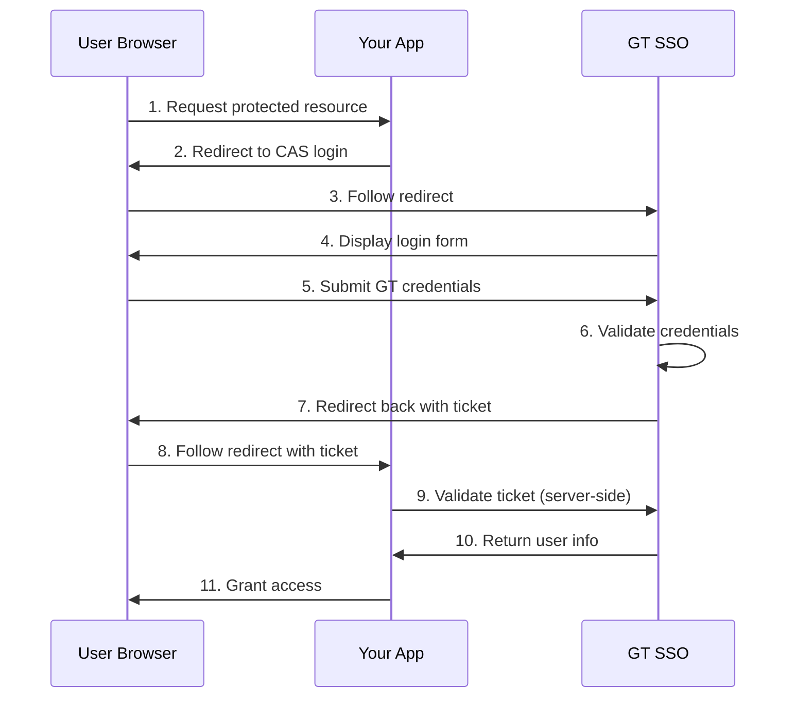

Building a web application for Georgia Tech students or staff? You will probably need to integrate with GT's Single Sign-On (SSO) system. This guide walks through implementing CAS (Central Authentication Service) authentication so users can log in with their GT credentials.

## What is CAS?

CAS is an enterprise single sign-on protocol that lets users authenticate once and access multiple applications without re-entering credentials. Georgia Tech uses CAS 3.0 for its SSO system.

**Why use GT SSO?**

- Users authenticate with existing GT credentials
- Your application never handles or stores passwords
- Authentication is managed centrally by GT
- Supports single logout across applications

## How CAS Authentication Works

CAS uses a ticket-based system with three main components:

| Component      | Description                                   |
| -------------- | --------------------------------------------- |
| **CAS Server** | GT's authentication server (`sso.gatech.edu`) |
| **Service**    | Your application (the service provider)       |
| **User**       | The person authenticating                     |

The system issues two types of tickets:

- **Service Ticket (ST)**: A one-time-use token issued after successful login
- **Ticket Granting Ticket (TGT)**: A session cookie on the CAS server (invisible to your app)

## GT SSO Endpoints

Here are the endpoints you will need:

| Purpose            | URL                                              |
| ------------------ | ------------------------------------------------ |
| Login              | `https://sso.gatech.edu/cas/login?service={url}` |
| Validate (CAS 2.0) | `https://sso.gatech.edu/cas/serviceValidate`     |
| Validate (CAS 3.0) | `https://sso.gatech.edu/cas/p3/serviceValidate`  |
| Logout             | `https://sso.gatech.edu/cas/logout`              |

Use the CAS 3.0 endpoint (`/cas/p3/serviceValidate`) to get access to user attributes like email and display name.

## The Authentication Flow

Here is the complete flow from when a user visits your app to when they gain access:



**Step by step:**

1. User tries to access a protected resource on your app
2. Your app redirects to GT SSO with a `service` parameter
3. User enters their GT username and password on the SSO page
4. After successful authentication, CAS redirects back with a `ticket` parameter
5. Your app validates the ticket directly with the CAS server
6. If valid, the user is authenticated

## Implementation

### Step 1: Redirect to CAS Login

Construct the login URL with your service URL as a parameter:

```
https://sso.gatech.edu/cas/login?service=https://yourapp.com/auth/callback
```

Example in JavaScript:

```javascript
function redirectToCAS() {
  const casLoginUrl = "https://sso.gatech.edu/cas/login";
  const serviceUrl = encodeURIComponent("https://yourapp.com/auth/callback");
  window.location.href = `${casLoginUrl}?service=${serviceUrl}`;
}
```

**Important:** The `service` URL must exactly match what you use during validation.

### Step 2: Handle the Callback

After authentication, CAS redirects to your callback URL with a ticket:

```
https://yourapp.com/auth/callback?ticket=ST-12345-abcdefg-sso
```

### Step 3: Validate the Ticket

Make a server-side request to validate the ticket:

```javascript
async function validateTicket(ticket, serviceUrl) {
  const validateUrl = new URL("https://sso.gatech.edu/cas/p3/serviceValidate");
  validateUrl.searchParams.set("ticket", ticket);
  validateUrl.searchParams.set("service", serviceUrl);

  const response = await fetch(validateUrl.toString());
  const xmlText = await response.text();

  return parseXMLResponse(xmlText);
}
```

### Step 4: Parse the Response

A successful authentication returns XML like this:

```xml
<cas:serviceResponse xmlns:cas="http://www.yale.edu/tp/cas">
  <cas:authenticationSuccess>
    <cas:user>gburdell3</cas:user>
    <cas:attributes>
      <cas:mail>george.burdell@gatech.edu</cas:mail>
      <cas:displayName>George P. Burdell</cas:displayName>
    </cas:attributes>
  </cas:authenticationSuccess>
</cas:serviceResponse>
```

A failed authentication looks like this:

```xml
<cas:serviceResponse xmlns:cas="http://www.yale.edu/tp/cas">
  <cas:authenticationFailure code="INVALID_TICKET">
    Ticket ST-12345-abcdefg-sso not recognized
  </cas:authenticationFailure>
</cas:serviceResponse>
```

Here is a simple parser:

```javascript
function parseCASResponse(xmlText) {
  const userMatch = xmlText.match(/<cas:user>([^<]+)<\/cas:user>/);
  if (userMatch) {
    return {
      success: true,
      user: userMatch[1],
    };
  }

  const failureMatch = xmlText.match(
    /<cas:authenticationFailure[^>]*>([^<]*)<\/cas:authenticationFailure>/
  );
  if (failureMatch) {
    return {
      success: false,
      error: failureMatch[1].trim() || "Authentication failed",
    };
  }

  return { success: false, error: "Invalid CAS response" };
}
```

### Step 5: Create a Session

After validating the ticket, create your own application session:

```javascript
app.get("/auth/callback", async (c) => {
  const ticket = c.req.query("ticket");
  const result = await validateTicket(ticket, serviceUrl);

  if (result.success) {
    const session = await createSession(result.user);

    setCookie(c, "session", session.id, {
      httpOnly: true,
      secure: true,
      sameSite: "Lax",
    });

    return c.redirect("/dashboard");
  }

  return c.redirect("/login?error=auth_failed");
});
```

## Common Issues and Solutions

### "Service not authorized" Error

Your service URL is not registered with GT's CAS server. Contact Georgia Tech IT to register your application's callback URL.

### "INVALID_TICKET" Error

This happens when:

- The ticket was already used (tickets are single-use)
- The service URL does not match between login and validation
- The ticket expired (typically 5-10 seconds)

Make sure the `service` parameter is identical in both requests.

### "INVALID_SERVICE" Error

The service URL format is incorrect. Check that you:

- Use HTTPS
- Properly URL-encode the service parameter
- Are consistent with trailing slashes

### Redirect Loop

Your app keeps redirecting to CAS after successful authentication. This usually means session management is not working correctly after ticket validation.

## Security Best Practices

**Do:**

- Always validate tickets server-side
- Use HTTPS for all CAS communication
- Handle tickets immediately (they expire quickly)
- Create your own session after validation
- Log authentication events for auditing

**Don't:**

- Reuse tickets (each is single-use)
- Expose tickets in logs
- Validate on the client side
- Hardcode service URLs

## Resources

- [Apereo CAS Documentation](https://apereo.github.io/cas/)
- [CAS Protocol Specification](https://apereo.github.io/cas/protocol/CAS-Protocol-Specification.html)
